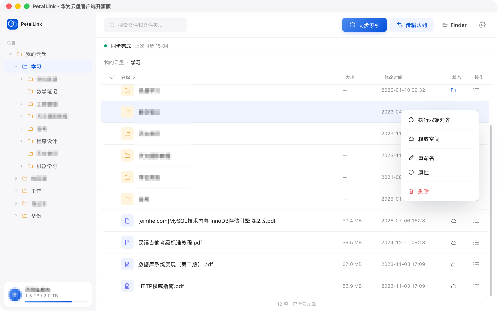
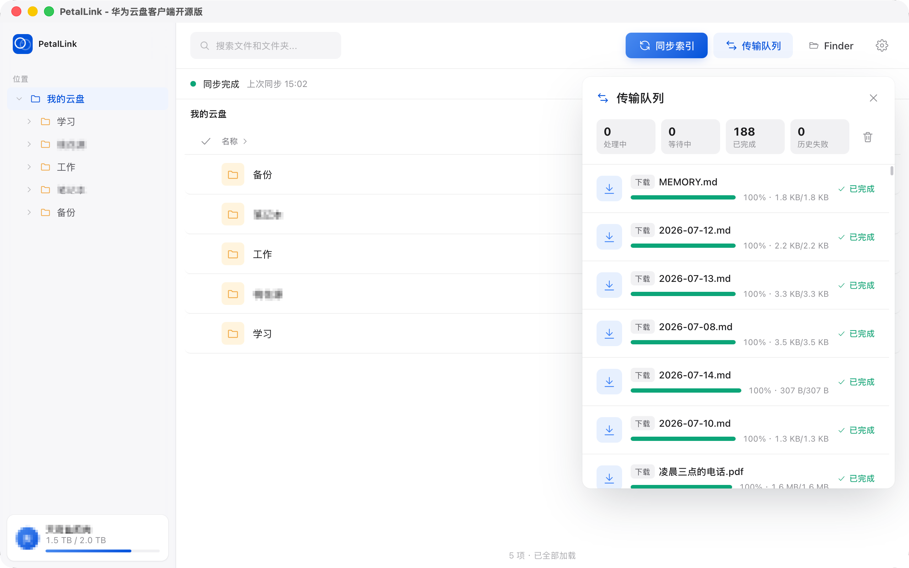
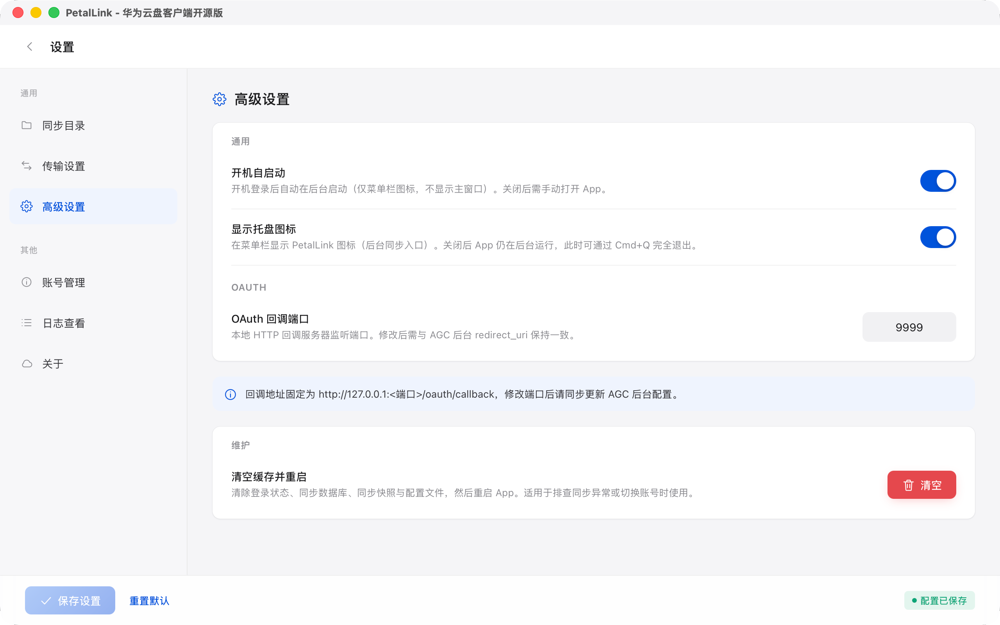

<p align="center"></p>

# PetalLink

华为云盘桌面客户端 —— 基于 REST API，将华为云空间映射到本地，双向实时同步。

> PetalLink 通过华为 AGC REST API 直连，不依赖 HMS Core SDK。macOS 继续使用现有的传统同步目录；Linux x86_64 仅提供 FUSE3 按需云盘，范围与限制见 [Linux 支持说明](docs/Linux.md)。

[](LICENSE)
[](https://v2.tauri.app/)
[](https://www.rust-lang.org/)
[](https://www.apple.com/macos/)
[](docs/Linux.md)

---

## 预览

<table>
  <tr>
    <td width="50%" align="center">
      
      <br /><sub>📂 主界面 — 文件浏览</sub>
    </td>
    <td width="50%" align="center">
      
      <br /><sub>📄 文件列表 — 文件操作</sub>
    </td>
  </tr>
  <tr>
    <td width="50%" align="center">
      
      <br /><sub>📤 传输队列 — 上传下载</sub>
    </td>
    <td width="50%" align="center">
      
      <br /><sub>⚙️ 设置页面 — 配置偏好</sub>
    </td>
  </tr>
</table>

---

## 特性

| <div style="width:75px">模块</div> | 能力 |
|----------------------------------|---|
| **授权登录**                         | OAuth 2.0 + PKCE（S256）；`openid profile drive` 全盘访问；Token 自动刷新 + 机器码绑定的 `token.bin` 加密存储 |
| **网盘主界面**                        | 双栏布局（侧边栏递归目录树 + 文件列表）；面包屑导航；搜索；新建文件夹 |
| **文件操作**                         | 上传（≤20MB multipart + >20MB 分片续传）、Range 断点下载、删除、重命名、移动、缩略图；写操作按 fileId 核验后才结算 |
| **拖拽上传**                         | 文件/文件夹拖入文件列表即复制进同步目录（`.tmp` 原子落盘、同名拒绝覆盖），随后自动上传到云端；传输队列实时可见进度 |
| **双向同步**                         | 本地 FSEvents/inotify + 3s debounce；华为 Changes 增量同步 + BFS 兜底；tree/path/cursor 原子可信 checkpoint；三段式稳定性检查 |
| **Linux 按需云盘**                    | Linux 唯一的目录模式；用户只选择一个可见云盘目录，完整云端树立即可见，交互式应用首次读取自动下载；后台缩略图与内容索引不会触发批量落地，私有缓存由应用管理 |
| **后台运行**                         | 托盘可用时关闭窗口仅隐藏 UI，同步引擎继续运行；托盘隐藏或不可用时关闭窗口会完全退出 |
| **开机自启动**                        | 设置页开关；macOS 使用 LaunchAgent，Linux 使用 XDG Autostart，均以 `--hidden` 模式启动 |
| **安全更新**                         | 官方 macOS 与 Linux AppImage 使用同一更新公钥校验签名；AUR/发行版软件包不在应用内自更新，继续由包管理器维护 |
| **冲突处理**                         | 自动重命名副本（60s 容忍窗口 + 副本去重 + 云端删除时保护本地修改） |
| **配置管理**                         | 集中设置页：OAuth 回调地址、云盘目录、并发数（默认 6）、debounce 时长（默认 3s）、跳过文件列表、是否显示托盘图标 |
| **传输队列**                         | 持久化状态机；上传/下载排队执行，主页删除完成后留痕可见；等待网络、退避、远端核验、需重新规划、永久失败分开展示；网络恢复自动续跑 |
| **释放空间**                         | 支持文件与目录（递归子树）；执行前弹窗列出可释放文件名与大小供二次确认；逐项复核可信云树、远端 fileId、成功基线、本地 mtime/size 与活动任务，防止 TOCTOU 误删 |
| **日志系统**                         | 三层输出（终端 + 滚动文件 + 环形缓冲）；日志查看导出页面 |

---

## 技术栈

| 层 | 技术 |
|---|---|
| **后端** | Rust + [Tauri 2.x](https://v2.tauri.app/) |
| **前端** | Vue 3 + TypeScript + Vite + Pinia |
| **数据库** | SQLite（rusqlite, bundled） |
| **HTTP** | reqwest（rustls-tls） |
| **文件监听** | notify（macOS FSEvents / Linux inotify） |
| **Linux 虚拟盘** | fuser + Linux FUSE3（无需动态链接 libfuse） |
| **安全存储** | `token.bin` + ChaCha20-Poly1305 AEAD（macOS IOPlatformUUID / Linux machine-id） |
| **UI 设计** | Mate 组件库 + 自建 design token |
| **日志** | tracing + tracing-appender |

---

## 前置要求

- [Rust](https://rustup.rs/) 1.85+
- [Node.js](https://nodejs.org/) 20+（推荐 24+）

macOS：

- macOS 12 Monterey 及以上
- Xcode Command Line Tools（`xcode-select --install`）

Linux：

- x86_64 Linux；目录功能仅提供 FUSE3 按需云盘
- WebKitGTK 4.1、GTK 3、AppIndicator、OpenSSL、`xdg-open`、FUSE3；建议同时安装 `lsof`
- 系统必须提供可用的 `/dev/fuse` 与 `fusermount3`
- 用户选择的云盘目录必须完全为空（包括隐藏文件），其父目录必须允许当前用户挂载
- 应用私有数据所在文件系统必须支持 `user.*` 扩展属性；应用会在启用前自动探测

Debian/Ubuntu 的完整依赖命令及平台限制见 [docs/Linux.md](docs/Linux.md)。

---

## 快速开始

### 1. 克隆仓库

```bash
git clone git@github.com:yuanbaobaoo/PetalLink.git
cd PetalLink
```

### 2. 安装依赖

```bash
# Rust 依赖
cargo fetch

# 前端依赖（同时安装项目锁定的 Tauri CLI）
cd app && npm ci && cd ..
```

### 3. 配置 OAuth 凭据

```bash
cp .env.example .env
```

编辑 `.env`，填入真实的 `HWCLOUD_CLIENT_ID` 和 `HWCLOUD_CLIENT_SECRET`（从 [AGC 控制台](https://developer.huawei.com/consumer/cn/service/josp/agc/index.html) 获取）。

### 4. 启动开发环境

```bash
./app/node_modules/.bin/tauri dev --config tauri.dev.conf.json
```

前端运行在 `http://localhost:1420`（HMR 热更新），Rust 后端自动编译启动。

### Rust / TypeScript IPC 类型

Tauri command、event、DTO 和共享常量统一在 Rust 侧定义，并由
`tauri-specta` 生成 `app/api/generated.ts`。该文件是构建产物，请勿手动修改。

- `./app/node_modules/.bin/tauri dev`：前端 `predev` 在 Vite 启动前自动生成。
- `./app/node_modules/.bin/tauri build`：前端 `prebuild` 在打包前自动生成。
- `cd app && npm run dev` / `npm run build`：同样会先自动生成。
- `cd app && npm run bindings`：仅在需要单独刷新或排查生成结果时使用。

普通 `cargo build` 只编译 Rust 后端，不构建前端；需要生成前端 bindings 或打包
桌面应用时应使用上面的 Tauri/npm 命令。

开发期由 `.taurignore` 将 bindings、Vite 缓存和前端构建目录排除在 Rust watcher
之外；这些生成物的变化不会重启后端进程。

新增供 IPC 使用的 Rust entity 时，为其派生 `specta::Type`，并将它用于已注册的
command 或 event 即会被递归导出；前端直接从 `app/api/generated.ts` 或现有
`app/api/*` 业务适配层导入，不再复制接口定义、命令名和事件名。生成的 commands
统一通过 `app/api/tauri.ts` 调用，以便在一个入口归一化非结构化异常。

---

## 测试

```bash
# 查看当前测试清单（不在文档中维护固定数量）
cargo test -- --list

# 编译全部 target 与测试，但不执行
cargo test --all-targets --no-run

# 全部 Rust 测试
cargo test

# 真实云端手工上传测试（默认忽略）
HWCLOUD_TEST_FILE="<file_path>" cargo test --test upload_tester -- --ignored --nocapture
```

测试集中在根目录 `tests/`，覆盖以下模块：

| 类型 | 覆盖模块 |
|---|---|
| 核心合同测试 | auth / config / paths / logging / platform / error contract |
| Drive 协议测试 | Files / Changes / download / upload / ASCII JSON / model parsing / client error |
| 同步测试 | cloud tree / conflict / engine / path recovery / retry policy / stability / state / task recovery / transfer state / checkpoint store |
| 手工集成测试 | `upload_tester.rs`，需要真实 OAuth 环境和 `HWCLOUD_TEST_FILE`，默认 `#[ignore]` |

---

## 构建 & 打包

### 开发构建（仅前端）

```bash
cd app && npm run build    # 类型检查 + Vite 打包
```

### 开发打包（.app + DMG，带 Dev 后缀）

```bash
./app/node_modules/.bin/tauri build --debug --config tauri.dev.conf.json
```

产物带 `-Dev` 后缀，与正式版共存互不影响（不生成更新包）：

```
target/debug/bundle/macos/PetalLink-Dev.app
target/debug/bundle/dmg/PetalLink-Dev_<version>_aarch64.dmg
```

### 生产发布（.app + DMG）

```bash
# 编译期自动读取 .env 文件注入凭据（无需手动设置环境变量）
./app/node_modules/.bin/tauri build
```

**产物位置**：

```
target/release/bundle/macos/PetalLink.app    # macOS 应用包
target/release/bundle/dmg/PetalLink_<version>_aarch64.dmg    # DMG 安装镜像 (~3.2MB)
```

### 安装说明

macOS 安全策略会拦截从互联网下载的未签名应用，双击 DMG 时可能提示「磁盘映像损坏」。请先移除隔离标记再打开：

```bash
xattr -d com.apple.quarantine ~/Downloads/PetalLink_*_aarch64.dmg
```

或者：

```bash
xattr -d com.apple.quarantine /Applications/PetalLink.app
```

**打包配置**：
- Release profile：`panic=abort`、`lto=true`、`opt-level=s`、`strip=true`
- 应用图标由 `build.rs` 自动从 `assets/` 生成多分辨率 PNG + `icon.icns`
- 最低 macOS 版本：12.0
- 架构：Apple Silicon (arm64) + Intel (x86_64) Universal Binary

### Linux AppImage

```bash
./app/node_modules/.bin/tauri build --bundles appimage
```

Linux 会自动合并 `tauri.linux.conf.json`，产物位于
`target/release/bundle/appimage/`。普通本地构建不会生成更新签名，也不会启用应用内
更新；官方 Release 由 Ubuntu 22.04 CI 使用 `tauri.linux.updater.conf.json`
生成 `.AppImage.sig`，并把 `linux-x86_64` 与 `darwin-aarch64` 一起写入
`PetalLink_update.json`。发布构建还应遵循“在计划支持的最老基础系统上构建
AppImage”的兼容要求。
若滚动发行版因 linuxdeploy 的旧 `strip` 无法识别 `.relr.dyn`，本地冒烟构建可临时
加 `NO_STRIP=1`；该变量不是发布兼容方案，正式包仍应在 Ubuntu CI 中生成。

官方 AppImage 只有在其所在目录允许当前用户原子替换文件时才显示“检查更新”。AUR、
Deb/RPM 或安装在 `/opt` 等不可替换位置的版本会关闭应用内更新，避免绕过 pacman/dnf/apt。
第一份启用 Linux 更新渠道的 AppImage 仍需用户手动安装一次，之后才可自动更新。

---

## 应用启动流程

1. 启动 App → 登录页 → 点「使用华为账号登录」→ 浏览器打开华为授权页
2. 在浏览器中完成授权（账号密码或手机扫码）→ 自动回到 App
3. Linux 点「选择云盘目录」，只选择一个完全为空的可见目录；应用自动创建并管理私有缓存，用户不得手动操作该缓存
4. macOS 仍按现有流程选择传统同步目录，该目录就是实际的本地镜像
5. 点击「同步索引」拉取云端文件树；Linux 随即可在文件管理器中浏览完整目录，首次打开未下载文件时自动取回内容

从旧 Linux 开发版升级前请先正常退出应用并确认旧目录中的本地修改已经上传。旧传统
同步目录不会被新版本自动搬移或删除，也不能直接作为 FUSE 云盘目录使用，除非已另行
备份并清理到完全为空；不要用 FUSE 挂载覆盖仍保存本地数据的旧目录。详细迁移边界见
[Linux 支持说明](docs/Linux.md#旧开发版迁移)。

**后台运行**：
- 启动后显示 PetalLink 托盘图标（可关闭），鼠标悬停显示「PetalLink — 后台同步中」
- 托盘可用时关闭窗口 → **仅隐藏 UI 层**，同步引擎继续运行
- 点击托盘图标 →「显示主窗口」→ UI 恢复
- **托盘菜单「退出 PetalLink」→ 真正退出进程**
- 托盘隐藏、创建失败或桌面环境不支持托盘时，关闭主窗口会真正退出

---

## 项目结构

```
PetalLink/
├── src/                         # Rust 后端（Tauri）
│   ├── main.rs                  # 入口
│   ├── lib.rs                   # 应用装配 + IPC 挂载 + setup
│   ├── ipc.rs                   # command/event/常量注册 + TypeScript bindings 生成
│   ├── commands.rs              # 命令运行时与统一导出
│   ├── commands/                # Tauri 命令按领域拆分
│   ├── auth/                    # OAuth + PKCE + token.bin 加密存储
│   ├── drive/                   # 华为 Drive REST API 客户端（Files/Upload 已按职责拆分）
│   ├── sync/                    # 同步引擎（engine/executor/TaskRunner 均按职责拆分）
│   ├── mount/                   # 本地镜像 + FSEvents/inotify 监听
│   ├── data/                    # SQLite 数据层
│   ├── core/                    # 配置/日志/缓存
│   └── platform/                # 桌面平台能力（托盘/activation/xattr/开机自启）
├── app/                         # Vue3 前端
│   ├── views/                   # 页面（Login/Main/Settings/LogViewer）
│   ├── stores/                  # Pinia 状态管理
│   ├── api/                     # 生成的 IPC bindings + 少量业务适配
│   │   ├── generated.ts         # tauri-specta 自动生成，禁止手动修改
│   │   ├── tauri.ts             # generated commands 的 invoke 与 AppError 归一化
│   │   └── auth/config/drive/sync/transfer 等展示、校验或类型收窄适配
│   ├── components/mate/         # Mate 组件库
│   └── styles/                  # design token
├── assets/                      # 品牌图标资源（唯一图源）
├── design/prototype/            # UI 设计原型
├── tests/                       # 集成测试
│   └── upload_tester.rs         # 默认忽略的真实云端手工集成测试
├── docs/                        # 需求文档 + 概要设计 + API 整理
├── Cargo.toml                   # Rust 依赖
├── tauri.conf.json              # Tauri 配置
├── tauri.linux.conf.json        # Linux AppImage 配置覆盖
├── tauri.linux.updater.conf.json # 官方 Linux 签名更新构建覆盖
└── build.rs                     # 构建脚本（图标自动同步）
```

---

## 文档

| 文档 | 说明 |
|---|---|
| [docs/Linux.md](./docs/Linux.md) | Linux 支持范围、依赖、文件系统要求、验证与 PR 拆分 |
| [docs/Linux-Test-Report.md](./docs/Linux-Test-Report.md) | Linux 跨发行版、桌面环境与按需读取测试结果 |
| [docs/概要设计文档.md](./docs/概要设计文档.md) | 项目架构、功能需求、数据流、API 接口、设计决策 |
| [docs/api调用整理.md](./docs/api调用整理.md) | 华为 Drive REST API 完整清单（23 个调用场景，含分片上传 308/Location 详解） |
| [design/prototype/](./design/prototype/) | UI 设计原型（login / main / settings） |

---

## License

[Apache License 2.0](LICENSE) © 2026 PetalLink

本项目仅供个人学习与自用。华为云空间服务及相关 API 归华为所有，请遵守华为开发者联盟相关协议。使用本项目产生的任何数据丢失、账号封禁等问题，项目维护者不承担责任。

---

## 相关项目

[ccdarkness/huaweicloud](https://github.com/ccdarkness/huaweicloud)：一个 Node.js 实现的华为云盘同步脚本，曾验证了 REST API 方案的可行性。
